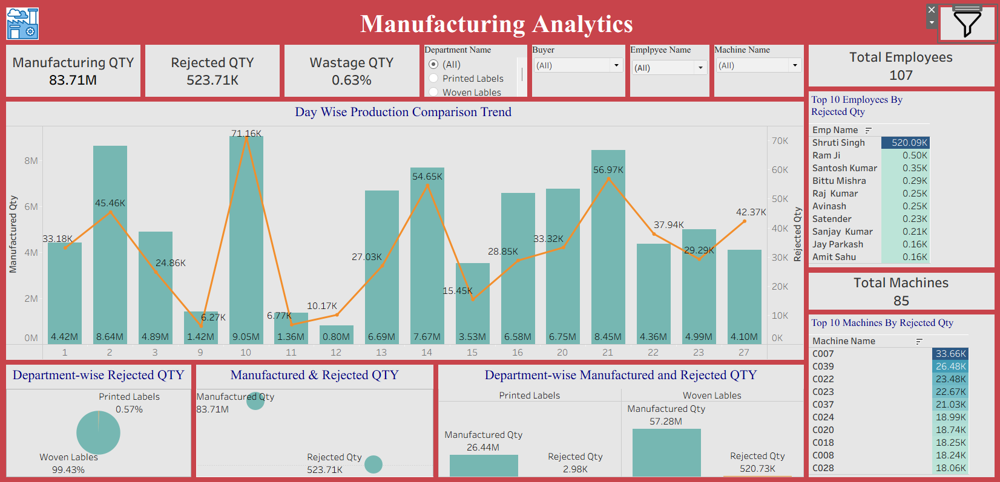

6## Dashboard Preview

## Project Overview
This project analyzes manufacturing operations data using Power BI, SQL, and Excel. The dashboard helps monitor production performance, rejection trends, machine efficiency, and employee productivity.

## Tools Used
- Power BI
- SQL
- Microsoft Excel

## Key KPIs
- Manufactured Quantity
- Processed Quantity
- Rejected Quantity
- Rejection Percentage
- Employee Performance
- Machine Performance

## Dashboard Features
- Production Quantity Analysis
- Rejected Quantity Tracking
- Employee-wise Performance
- Machine-wise Performance
- Department-wise Analysis
- Day-wise Production Trends

## Business Insights
- Identified machines with the highest rejection rates.
- Tracked employee productivity and performance.
- Analyzed production trends across different periods.
- Highlighted operational areas requiring improvement.

## Outcome
The dashboard provides management with actionable insights to improve production efficiency, reduce rejection rates, and monitor operational performance.

## Author
Sonal Salvi
Operations Analyst | Reporting Analyst | MIS Analyst
LinkedIn: https://linkedin.com/in/sonal-salvi-9a31b32b1/
